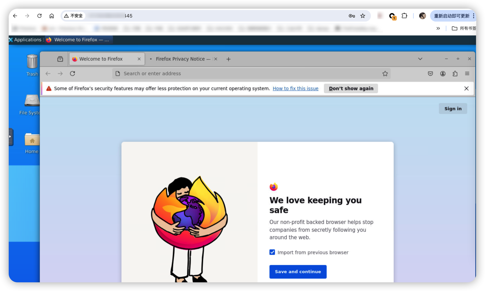

# noVNC FOR Ubuntu20.4

依赖
docker, docker-compose

### 设置密码

1. 设置宿主机的变量 =号后面是密码 ***注意这里的优先级高于下面的.env, 设置了这里.env就不生效了!!!***

```
export VNC_PASS=XXX 
```

2. 修改.env文件  其中eeeff是密码

```
sed -i 's/VNC_PASS=.*/VNC_PASS=eeefff/g' .env
```

### 修改端口, 默认是8888

修改端口为80

```
sed -i 's/- 8888:8888/- 80:8888/g' docker-compose.yml
```

### build

```
docker-compose build vnc-ubuntu
```

### 启动

```
docker-compose up -d

```

### 效果

浏览器里输入 ip:port 就可以访问了

